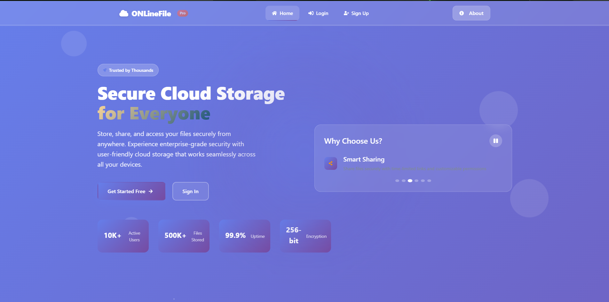
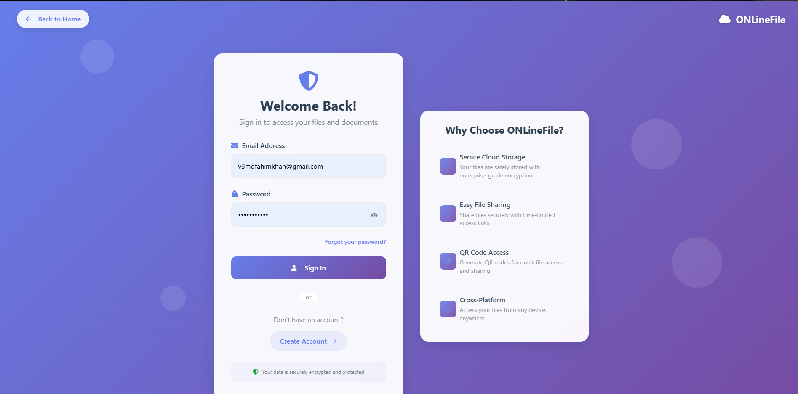
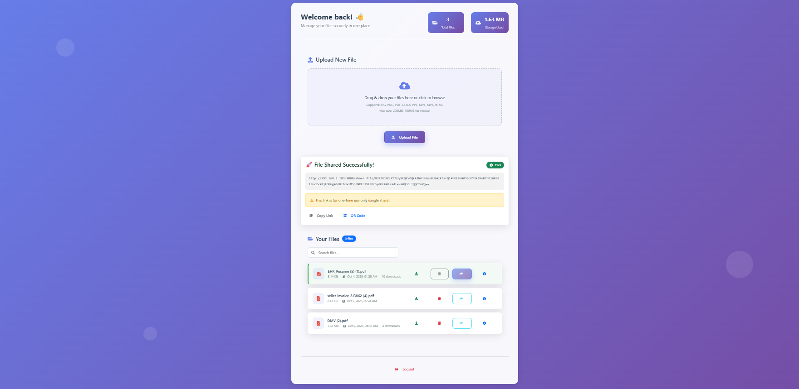

# ☁️ ONLineFile – Secure Cloud Storage Platform

> A modern, secure, and responsive cloud storage web application built with **React.js** and powered by **JWT-based authentication**.

---

## 🧩 Overview

**ONLineFile** is a cloud-based file management system designed for **secure file storage, sharing, and collaboration**.  
It offers enterprise-level security, an elegant UI, and fast real-time performance — all within a seamless user experience.

The system enables users to:
- Upload and manage files efficiently.
- Share documents via **time-limited links** or **QR codes**.
- Authenticate securely using **JSON Web Tokens (JWT)**.
- Enjoy a responsive, user-friendly design built with React.

---

## 🖼️ Frontend Preview

Here’s how the **ONLineFile Frontend** looks in action 👇  

### 🏠 Landing Page  
  

### 🔐 Login Page  
  

### 🧾 Signup Page  
  

### 📁 File Manager Dashboard  
  
 

> 📸 *Tip:* Place these screenshots inside a `/screenshots` folder in your repo root for automatic GitHub rendering.

---

## 🚀 Features

### 🔐 Authentication
- User **signup**, **login**, and **JWT-based session management**.
- Secure local storage for tokens.
- Protected routes implemented via `ProtectedRoute.jsx`.

### 📁 File Management
- Upload, download, delete, and preview files.
- Drag-and-drop upload functionality with progress feedback.
- File size validation (200MB general / 100MB video).
- File metadata display (name, size, upload date, download count).
- Instant search and filter capability.

### 🔗 File Sharing
- Generate one-time **120-second secure share links**.
- **QR code** generation for mobile sharing.
- Automatic link expiration countdown.

### 🎨 User Interface
- Fully responsive across devices (desktop, tablet, mobile).
- **Glassmorphism** design with gradient accents.
- Animated transitions and scroll-aware navigation.
- Accessible and WCAG 2.1 AA compliant.

### 🧠 System Architecture
- **Frontend:** React.js, React Router, Axios  
- **Backend:** Spring Boot REST API  
- **Database:** SQL-based (MySQL/PostgreSQL)  
- **Security:** JWT, CORS, HTTPS  

---

## 🏗️ Project Structure

```plaintext
src/
│
├── App.js                 # Main router setup
├── Body.jsx               # Landing page
├── Login.jsx              # User authentication
├── Signup.jsx             # User registration
├── FileManager.jsx        # File management interface
├── ProtectedRoute.jsx     # Secure route component
├── Header.jsx             # Navigation bar
├── Footer.jsx             # Footer section
└── assets/                # Static images, icons, styles
